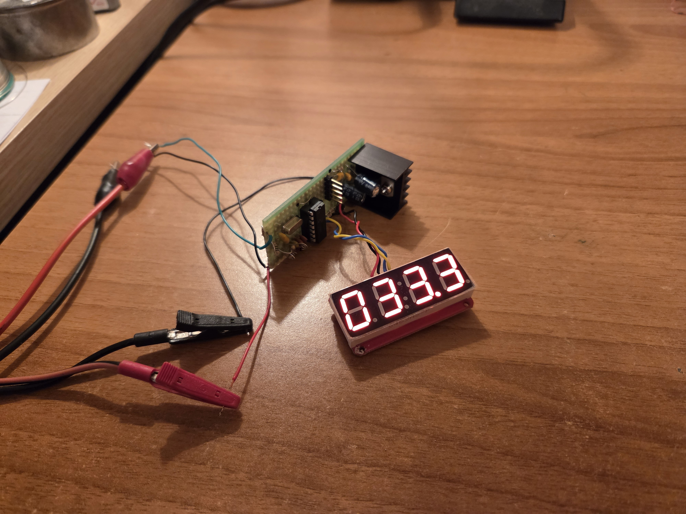

  

A simple 0-110V Voltmeter with 4x7-segment LED indication.
-----------------------------------------------------------------

A simple voltmeter to measure voltages of up to 110V. The input  
current has been calculated to be 100 uA @ 110V.  
The voltmeter itself can be supplied with voltages of >8V.  
The voltmeter's own current consumption is 90 mA @ 12V.  
A small heatsink is mounted to 7805 but it could probably survive without it.  
Resolution is 100 mV. Accuracy has been measured 0.3% typical and 1% maximum.  
